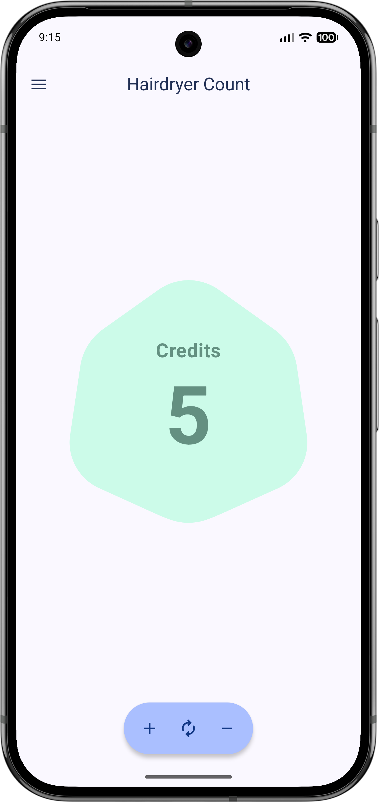
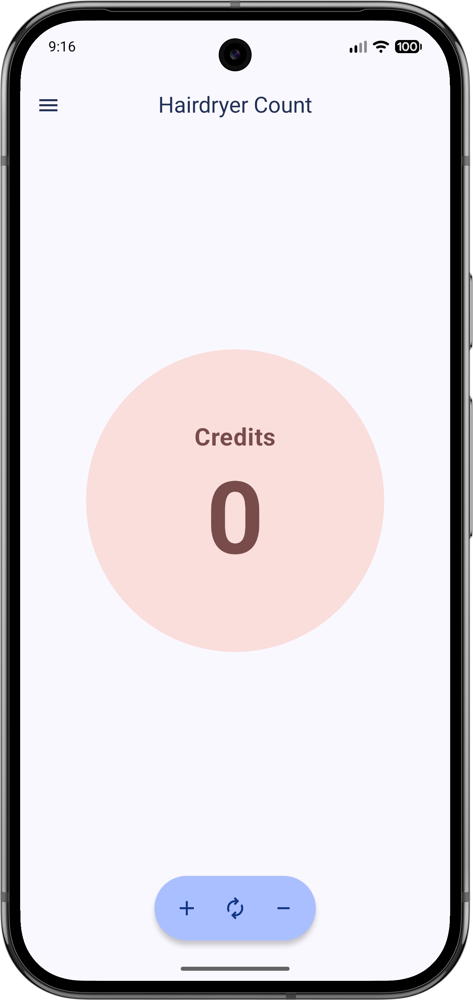
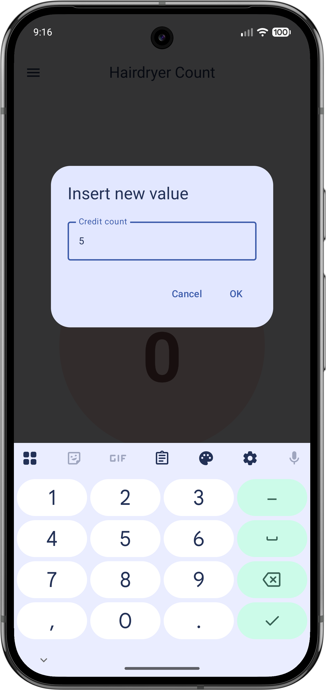
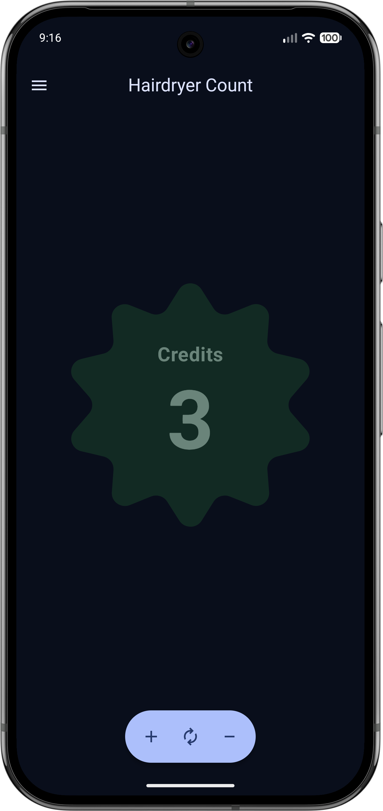
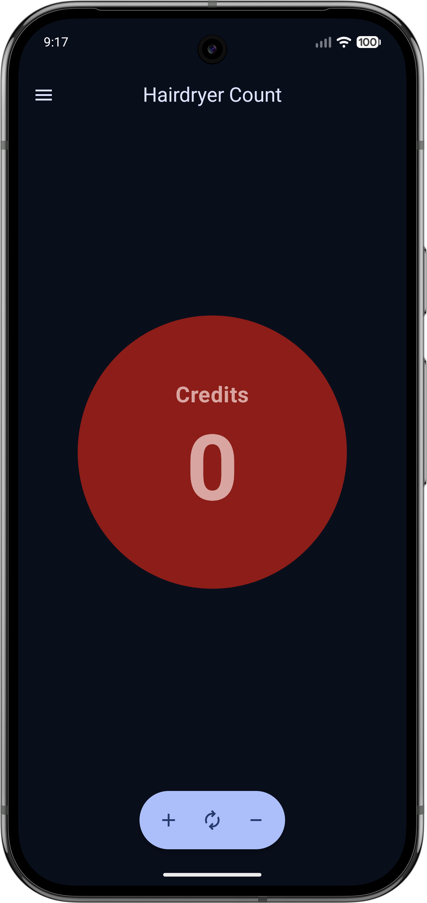
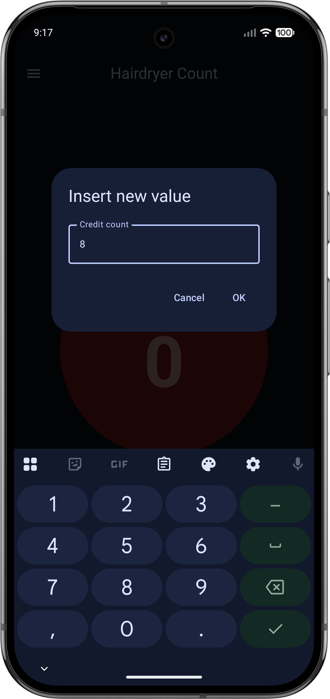

# PHD Counter App
Simple Android app created to count the credits for the public hairdryer at my city's swimming pool.
Made with Jetpack Compose and Material 3 Expressive.

## Screenshots
### Light Mode

  
  
  

### Dark Mode

  
  
  

